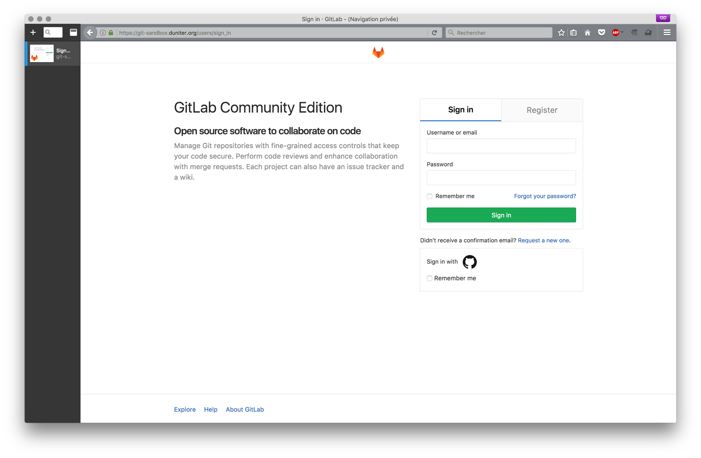
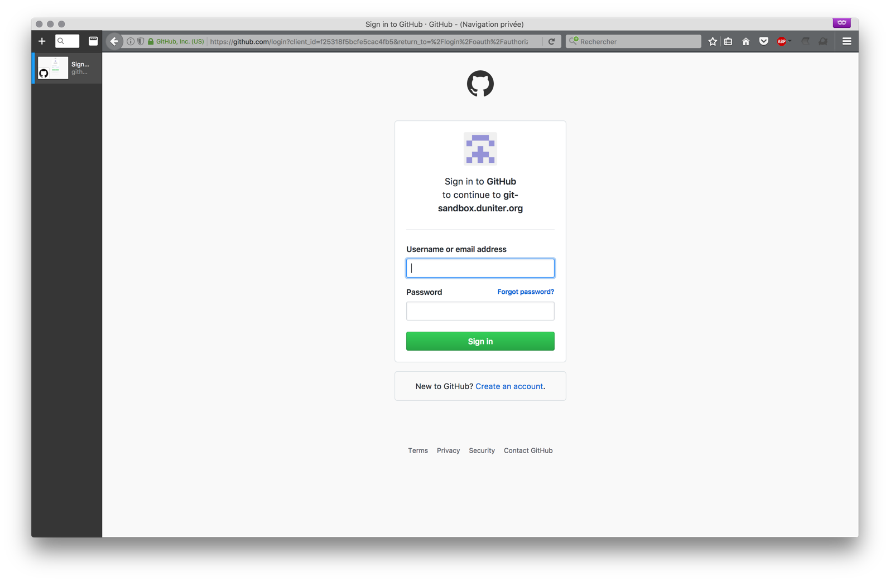
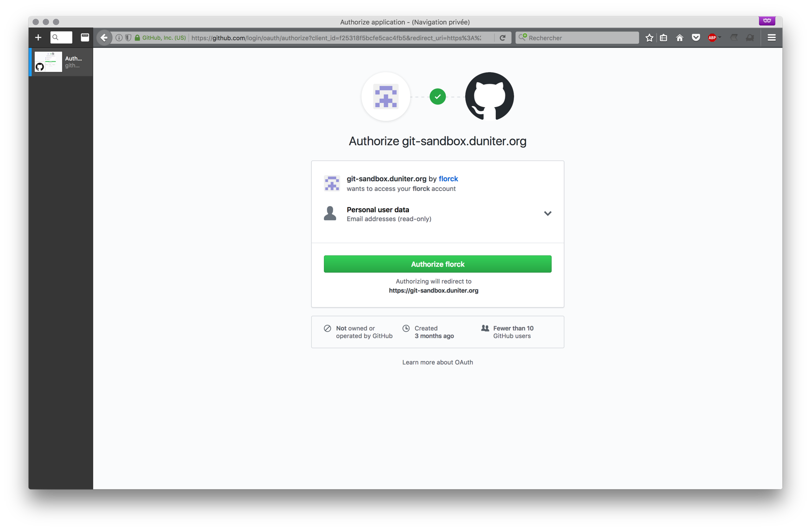
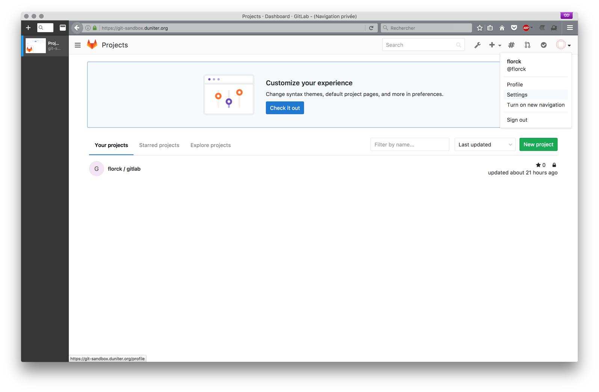
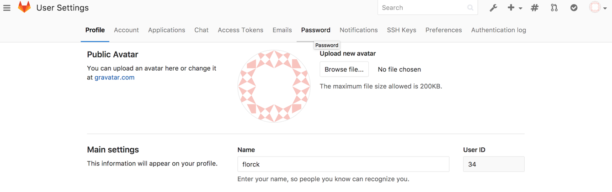
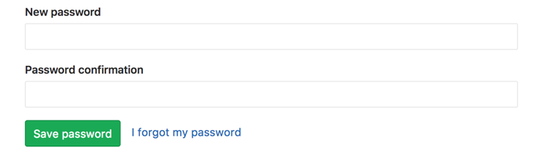

# First Connection with github
Go to duniter gitlab

Click on sign in with github

Fill in the github form

Authorize gitlab to read information

# Create a gitlab password
Click on your avatar (top right) and then on settings

Then click on password

Create your new password

Up to now, you should be able to connect using either github, or direct email + password.
Email used there will be the one set in github.
