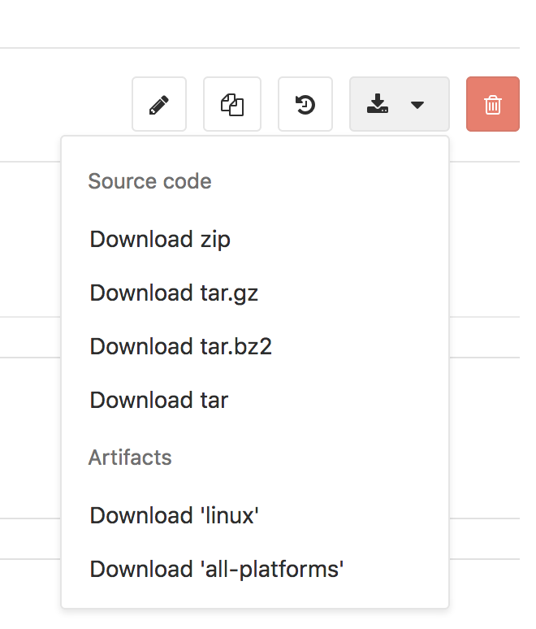
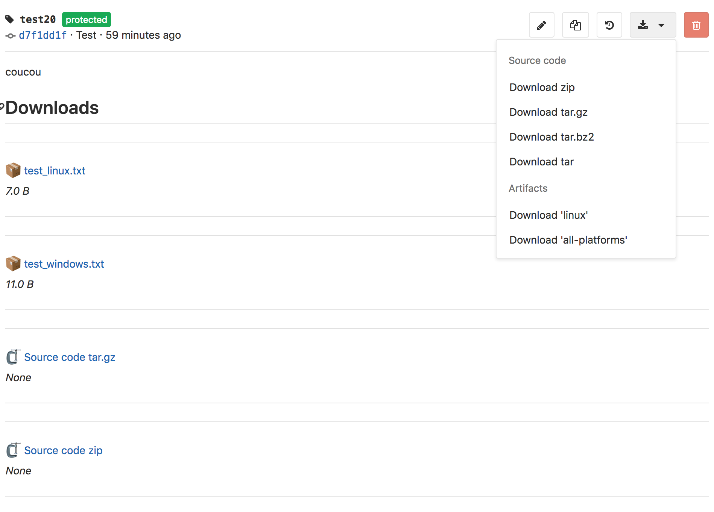

# Sur quel runner jouer
Pour des raisons de praticité, il sera probablement nécessaire de mettre en place un runner sur votre machine qui jouera les builds de releases comme vous les lanciez à la main.

# Installer un runner sur sa machine
Procédure à suivre ici : https://docs.gitlab.com/runner/install/osx.html

# Mettre en place la création des Artifacts
Cela se fait en plusieurs étapes.
- Première étape le build de l'ensemble des binaires
- Deuxièmement, un job par binaire, afin que dans le menu de téléchargement on puisse télécharger séparément chacun d'entre eux


```
stages:
  - build-all
  - release

all-platforms:
  stage: build-all
  tags:
    - florck-demo
  script:
    - >-
        echo "pouetpouet" > test_windows.txt
    - >-
        echo "bidule" > test_linux.txt
  artifacts:
    name: all
    when: always
    paths:
      - test_windows.txt
      - test_linux.txt
  only:
    - tags

linux:
  stage: release
  tags:
    - florck-demo
  script:
    - ls -l test_linux.txt
  artifacts:
    name: linux
    paths:
      - test_linux.txt
  only:
    - tags
```

# Ajout des liens de téléchargement dans le corps du message de release
En utilisant le script `releaser.py`

```
#!/usr/bin/python3
'''
This module is meant to overload the release note in gitlab for the current project.
Expects to find in environment following variables:
  - CI_PROJECT_URL - Automatically set by gitlab-ci
  - CI_COMMIT_TAG - Automatically set by gitlab-ci
  - CI_PROJECT_ID - Automatically set by gitlab-ci
  - CI_COMMIT_TAG - Automatically set by gitlab-ci
  - RELEASER_TOKEN - Token used by technical user
  - JOB_ARTIFACTS - String containing job name containing all artifacts, to set manually
  - EXPECTED_ARTIFACTS - List containing all artifacts generated to set manually
'''

import math
import urllib.request
import urllib.error
import json
import os
import jinja2

def convert_size(size_bytes):
    '''Print proper size'''
    if size_bytes == 0:
        return '0B'
    size_name = ('B', 'KB', 'MB', 'GB', 'TB', 'PB', 'EB', 'ZB', 'YB')
    i = int(math.floor(math.log(size_bytes, 1024)))
    power = math.pow(1024, i)
    size = round(size_bytes / power, 2)
    return '%s %s' % (size, size_name[i])

def get_current_message():
    '''Get current release message'''
    releaser_token = os.environ['RELEASER_TOKEN']
    ci_project_id = os.environ['CI_PROJECT_ID']
    ci_commit_tag = os.environ['CI_COMMIT_TAG']
    tag_url = 'https://git.duniter.org/api/v4/projects/'
    tag_url += ci_project_id
    tag_url += '/repository/tags/'
    tag_url += ci_commit_tag
    request = urllib.request.Request(tag_url)
    request.add_header('Private-Token', releaser_token)
    response = urllib.request.urlopen(request)
    data = json.load(response)
    if data['release'] is None:
        return False, ''
    else:
        return True, data['release']['description'].split('# Downloads')[0]

def build_artifact_url(artifact, source):
    '''Given an artifact name, builds the url to download it'''
    job_artifacts = os.environ['JOB_ARTIFACTS']
    ci_project_url = os.environ['CI_PROJECT_URL']
    ci_commit_tag = os.environ['CI_COMMIT_TAG']
    if source:
        source_url = ci_project_url
        source_url += '/repository/'
        source_url += ci_commit_tag
        source_url += '/archive.'
        source_url += artifact
        return source_url
    else:
        artifact_url = ci_project_url
        artifact_url += '/-/jobs/artifacts/'
        artifact_url += ci_commit_tag
        artifact_url += '/raw/'
        artifact_url += artifact
        artifact_url += '?job='
        artifact_url += job_artifacts
        return artifact_url

def get_artifact_weight(location):
    '''Retrieve size of artifacts'''
    size = os.path.getsize(location)
    return convert_size(int(size))


def build_compiled_message(current_message):
    '''Create a new release message using the release template'''

    expected_artifacts = os.environ['EXPECTED_ARTIFACTS']
    try:
        expected_artifacts = json.loads(expected_artifacts)
    except json.decoder.JSONDecodeError:
        print('CRITICAL EXPECTED_ARTIFACTS environment variable JSON probably malformed')
        print('CRITICAL Correct : \'["test_linux.txt","test_windows.txt"]\' ')
        print('CRITICAL Not Correct: "[\'test_linux.txt\',\'test_windows.txt\']" ')
        exit(1)
    artifacts_list = []
    for artifact in expected_artifacts:
        artifact_dict = {
            'name': artifact,
            'url': build_artifact_url(artifact, False),
            'size': get_artifact_weight(artifact),
            'icon': ':package:'
        }
        artifacts_list.append(artifact_dict)
    expected_sources = ['tar.gz', 'zip']
    for source in expected_sources:
        source_url = build_artifact_url(source, True)
        artifact_dict = {
            'name': 'Source code ' + source,
            'url': source_url,
            'size': get_artifact_weight(source_url),
            'icon': ':compression:'
        }
        artifacts_list.append(artifact_dict)

    j2_env = jinja2.Environment(
        loader=jinja2.FileSystemLoader(
            os.path.dirname(os.path.abspath(__file__))
            ),
        trim_blocks=True
        )
    # pylint: disable=maybe-no-member
    template = j2_env.get_template('release_template.md')
    return template.render(
        current_message=current_message,
        artifacts=artifacts_list
    )


def send_compiled_message(exists_release, compiled_message):
    '''Send to gitlab new message'''
    releaser_token = os.environ['RELEASER_TOKEN']
    ci_project_id = os.environ['CI_PROJECT_ID']
    ci_commit_tag = os.environ['CI_COMMIT_TAG']
    release_url = 'https://git.duniter.org/api/v4/projects/'
    release_url += ci_project_id
    release_url += '/repository/tags/'
    release_url += ci_commit_tag
    release_url += '/release'
    if exists_release:
        # We need to send a PUT request
        method = 'PUT'
    else:
        # We need to send a POST request
        method = 'POST'
    send_data = {
        'tag_name':ci_commit_tag,
        'description':compiled_message
        }
    send_data_serialized = json.dumps(send_data).encode('utf-8')
    request = urllib.request.Request(release_url, data=send_data_serialized, method=method)
    request.add_header('Private-Token', releaser_token)
    request.add_header('Content-Type', 'application/json')
    urllib.request.urlopen(request)

def main():
    '''Execute main scenario'''
    exists_release, current_message = get_current_message()
    compiled_message = build_compiled_message(current_message)
    send_compiled_message(exists_release, compiled_message)
    print('Artifacts uploaded successfully')
main()
```

Une fois fait, le fichier `gitlab-ci.yml` devient : 
```
stages:
  - build-all
  - release
  - release-message
all-platforms:
  stage: build-all
  tags:
    - florck-demo
  script:
    - >-
        echo "pouetpouet" > test_windows.txt
    - >-
        echo "bidule" > test_linux.txt
  artifacts:
    name: all
    when: always
    paths:
      - test_windows.txt
      - test_linux.txt

  only:
    - tags

linux:
  stage: release
  tags:
    - florck-demo
  script:
    - ls -l test_linux.txt
  artifacts:
    name: linux
    paths:
      - test_linux.txt
  only:
    - tags

enforce-message:
  stage: release-message
  tags:
    - florck-demo
  variables:
    JOB_ARTIFACTS: 'all-platforms'
    EXPECTED_ARTIFACTS: '["test_linux.txt","test_windows.txt"]'
  script:
    - python3 .gitlab/releaser.py
  only:
    - tags
```

