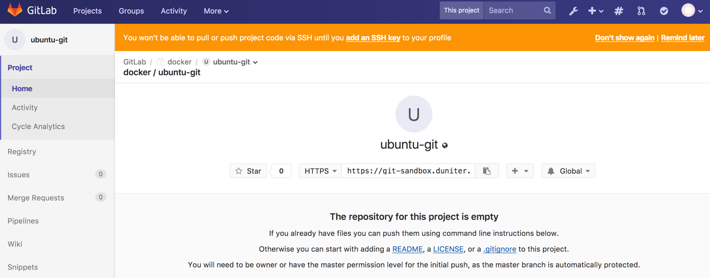

# Create the base docker image to be used in runner
Gitlab-ci runners we use are based on docker. Each job will be executed in a dedicated container, spotted at job start and deleted at job end.
A default docker image for this container must be provided.
To avoid using an external dependancy, we will customize a docker image to our needs and host it in our gitlab.

Here we create one image with git binaries available, from an ubuntu base image.

Create a public repository in gitlab


Create inside a Dockerfile in this repository
[Please refer to Dockerfile file for an example](./Dockerfile)

Create also a .gitlab-ci.yml file
```
test_build_image:
  image: docker:git
  services:
  - docker:dind
  script:
    - docker build .
  except:
    - tags

build_image:
  image: docker:git
  services:
  - docker:dind
  script:
    - docker login -u "gitlab-ci-token" -p "$CI_BUILD_TOKEN" $CI_REGISTRY
    - docker build --pull -t "$CI_REGISTRY_IMAGE:$CI_BUILD_TAG" .
    - docker push "$CI_REGISTRY_IMAGE:$CI_BUILD_TAG"
  only:
    - tags
```

As CI is not yet available (since we wan't to set it in this tuto !), no build will succeed yet.

Then we need to build it and push it manually.

So clone the repository on a local machine that get docker available.
In the folder make
```
docker build -t git-sandbox.duniter.org:5043/docker/ubuntu-git:16.04-DUNITER-1 .
docker login git-sandbox.duniter.org:5043
docker push git-sandbox.duniter.org:5043/docker/ubuntu-git:16.04-DUNITER-1
```

# Create a first runner
## On the host
Create folder for docker-compose files

```
mkdir /build/gitlab-runner01
```

Create the `docker-compose.yml` file:

```
version: '2'
services:
    gitlab-runner:
        image: $GITLAB_RUNNER_IMAGE
        domainname: duniter.org
        hostname: gitlabrunner01
        volumes:
            - /srv/gitlab-runner01/config:/etc/gitlab-runner
            - /var/run/docker.sock:/var/run/docker.sock
        restart: always
```

Create the folder

```
mkdir -p /srv/gitlab-runner01/config
```


## Start first time gitlab runner
Adapt the following gitlab runner image version with current you want to install :

```
GITLAB_RUNNER_IMAGE=gitlab/gitlab-runner:v9.4.2 docker-compose up -d
```

## Configure gitlab runner
Enter the docker container

```
docker exec -it gitlabrunner01_gitlab-runner_1 /bin/bash
```

Execute `gitlab-runner register`
and answer the questions. Token must be got from  https://git-sandbox.duniter.org/admin/runners
```
root@gitlabrunner01:/# gitlab-runner register
Running in system-mode.

Please enter the gitlab-ci coordinator URL (e.g. https://gitlab.com/):
https://git-sandbox.duniter.org/
Please enter the gitlab-ci token for this runner:
xfTHNeMhE8sAWUxbcxtc
Please enter the gitlab-ci description for this runner:
[gitlabrunner01.duniter.org]: Main runner for github synchronization
Please enter the gitlab-ci tags for this runner (comma separated):
github
Whether to run untagged builds [true/false]:
[false]: false
Whether to lock Runner to current project [true/false]:
[false]: false
Registering runner... succeeded                     runner=xfTHNeMh
Please enter the executor: docker-ssh, ssh, docker+machine, docker-ssh+machine, docker, shell, virtualbox, kubernetes, parallels:
docker
Please enter the default Docker image (e.g. ruby:2.1):
git-sandbox.duniter.org:5043/docker/ubuntu-git:16.04-DUNITER-1
Runner registered successfully. Feel free to start it, but if it's running already the config should be automatically reloaded!
```

Edit finally the `config.toml` file in the docker to activate the privilege tag.
```
[runners.docker]
    ...
    privileged = true
    volumes = ["/var/run/docker.sock:/var/run/docker.sock", "/cache"]
    ...
```
