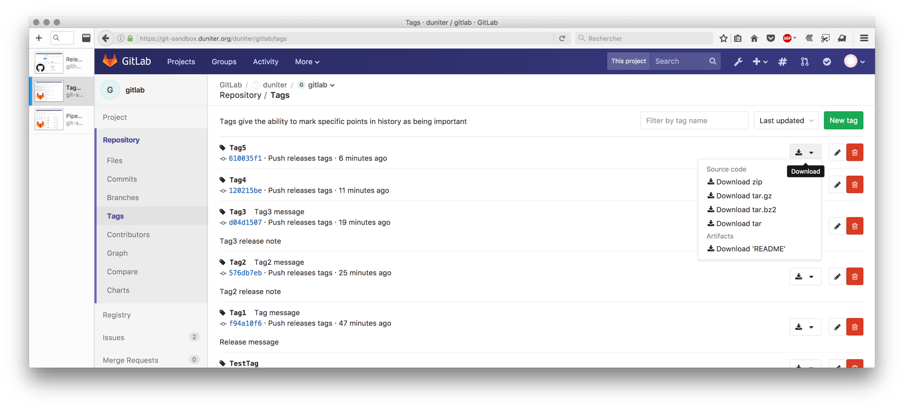

# Create Artifacts locally
Artifacts are stored in gitlab.

In order to appear with the proper name, each artifact needs to be created in a dedicated step in `.gitlab-ci.yml` that get as name the name of the artifact.


```
README:
  stage: build
  artifacts:
    name: README
    paths:
      - README.md
  script:
    - ls README.md
  only:
    - tags
```

# Export Artifacts to github
We use a binary named github-release to create a release based on the tag.
`https://github.com/aktau/github-release`
Then with the same binary we upload the artifact to github.

```
push_realease_to_github:
    stage: publish
    script:
      - export GITHUB_TOKEN=${GITHUB_TOKEN}
      - echo "Creating a new release in github"
      - github-release release --user duniter --repo gitlab --tag "${CI_BUILD_TAG}"
      - echo "Uploading the artifacts into github"
      - bash -c 'github-release upload --user duniter --repo gitlab --tag "${CI_BUILD_TAG}" --name "README.md" --file ./README.md'
    only:
      - tags
```
